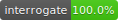

Simple FastAPI example following Calmcode
----------

Hi! This is an example FastAPI app following Calmcode's amazing [tutorial](https://calmcode.io/qr-code/generate.html) combining [python-qrcode](https://github.com/lincolnloop/python-qrcode) and [FastAPI](https://fastapi.tiangolo.com/). If you're reading this, PLEASE STAR these AMAZING python libraries and checkout the tutorial and other tutorials found on [Calmcode.io](https://calmcode.io/).

This is my first FastAPI app after going through TestDrivenio's [FastAPI course](https://testdriven.io/courses/tdd-fastapi/?utm_source=mrcartoonster). It's a beast and what I've done here is just the minimal. The course will show how to add your FastAPI to docker, push to heroku and set GitHub actions with a breeze!

<form action="https://www.paypal.com/donate" method="post" target="_top">
<input type="hidden" name="cmd" value="_donations" />
<input type="hidden" name="business" value="73Q9EN2ZMWSVU" />
<input type="hidden" name="currency_code" value="USD" />
<input type="image" src="https://www.paypalobjects.com/en_US/i/btn/btn_donateCC_LG.gif" border="0" name="submit" title="PayPal - The safer, easier way to pay online!" alt="Donate with PayPal button" />

</form>
